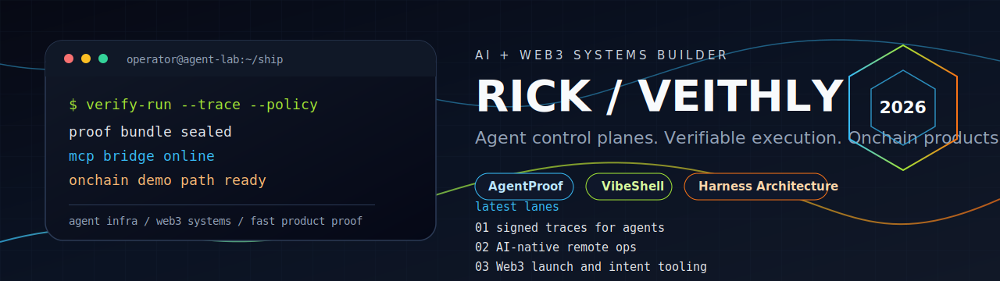
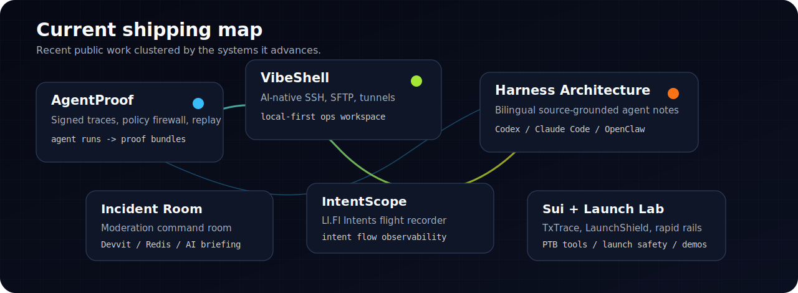

  

<h1 align="center">Rick / veithly</h1>

  AI + Web3 systems builder. I ship agent infrastructure, verifiable execution tools, and high-velocity onchain products.

  <a href="https://x.com/RickEACC">X</a> |
  <a href="mailto:veithly@live.com">Email</a>

---

## Current Signal

I am focused on the control layer around useful agents: traces, permissions, replay, remote operations, source-grounded harness design, and product surfaces where AI systems need to prove what they did.

I also build Web3 products that turn noisy protocol primitives into operator-grade experiences: intents, launch defense, programmable transaction debugging, confidential payroll, prediction rails, and rapid hackathon systems.

  

## Active Builds

| Project | What it proves | Stack / surface |
|---|---|---|
| [AgentProof](https://github.com/veithly/agentproof) | Signed flight recorder and policy firewall for AI agent runs. | Next.js, TypeScript, policy guards, proof bundles |
| [VibeShell](https://github.com/veithly/vibeshell) | AI-native SSH, SFTP, tunnel, and local terminal workspace for humans and agents. | Tauri, Rust, React, MCP, local-first ops |
| [Harness Architecture](https://github.com/veithly/harness-architecture) | Bilingual, source-grounded notes on real agent harness design. | Astro, MDX, Cloudflare Pages, Codex, Claude Code, OpenClaw |
| [build-your-own-agent](https://github.com/veithly/build-your-own-agent) | Loadable skill and scaffold for designing, building, and diagnosing agent harnesses. | Python, skills, linting, diagnosis scripts |
| [Incident Room](https://github.com/veithly/incident-room) | Devvit command room for live Reddit moderation incidents. | Devvit, React, Hono, Redis, OpenAI-compatible briefing |
| [IntentScope](https://github.com/veithly/intentscope) | LI.FI Intents flight recorder for builders. | TypeScript, Web3 observability, intent flows |
| [LaunchShield](https://github.com/veithly/launchshield) | Fair launches that defend themselves with Uniswap V4-native protection. | TypeScript, X Layer, launch security |
| [TxTrace](https://github.com/veithly/txtrace) | DevTools for Sui programmable transactions. | TypeScript, Sui, PTB debugging |

## Operating Range

| Lane | I tend to build |
|---|---|
| Agent infrastructure | Runtime traces, permission boundaries, replay tools, MCP workflows, verifier loops |
| AI-native operations | SSH/SFTP/tunnel tooling, local-first control rooms, observable automation |
| Web3 product systems | DeFi UX, launch safety, intents, Sui Move prototypes, confidential rails |
| Documentation that ships | Bilingual docs, source trails, architecture maps, skill-based scaffolds |
| Hackathon execution | Demo-first products with real workflows, not wrapper demos |

## Technical Arsenal

`TypeScript` `Rust` `Python` `Solidity` `Move` `React` `Next.js` `Tauri` `Astro` `Cloudflare` `Devvit` `Redis` `PostgreSQL` `MCP` `OpenAI-compatible APIs`

## Proof Points

- Core Dev of SpoonOS.
- Ambassador: Arbitrum, Nexus, SonicLab, Xion.
- Core contributor around Eliza / agent ecosystem work.
- Senator of HackQuest.
- SeeDAO Name Service contributor.
- OpenBuild, GDG, and PyCon volunteer.
- 10+ hackathon wins across AI, Web3, and full-stack product tracks.
- 6 patents in AI / ML.
- AWS Certified AI Practitioner.

## Build Philosophy

Useful AI systems need three things before they deserve more authority: observable execution, scoped permissions, and replayable evidence.

Useful Web3 products need the same discipline: fewer abstractions, clearer operator surfaces, and a demo path that survives real users.

That is the lane I like: small teams, fast ships, hard proof.
